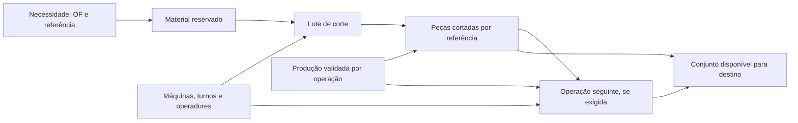

# Viabilidade de um sistema de planeamento para a MTG2 Perfis

**Atualização de 10/09/2026:** consultar as [regras operacionais confirmadas](/home/luis/projects/kanban-mes-mtg2/docs/planeamento-mtg2-2026-09-09/regras-confirmadas-2026-09-10.md) antes de usar as propostas deste relatório. Stock/SAP passa para a fase 2, não há transferência de parcelas entre corte e abocardar, OF fechadas no CPIS não admitem novos registos e os significados de contadores e prazos já foram esclarecidos. As medições históricas abaixo mantêm a sua data de referência.

O [aprofundamento posterior](/home/luis/projects/kanban-mes-mtg2/docs/planeamento-mtg2-2026-09-09/conclusao-aprofundada.md) concretiza o âmbito inicial na MEBA e abocardar, verifica a reconciliação entre versões e produção, corrige a comparação das fórmulas geométricas e acrescenta evidência sobre as unidades do histórico e a insuficiência dos tempos disponíveis.

**É possível construir um sistema útil com os dados existentes.** A primeira versão deve produzir um plano explicável, sujeito à confirmação das condições de execução. A passagem a um calendário automático com horas de início e fim exige completar o stock de perfis, os calendários, a elegibilidade das máquinas e os tempos de operação. A dificuldade principal está em dar o significado correto aos dados que já existem.

A proposta é representar **necessidades de peças, operações que as transformam, lotes que partilham material e recursos com disponibilidade limitada**. O plano deve responder a três perguntas: o que falta para completar cada necessidade, que trabalho está pronto para executar e qual a sequência que melhor protege os prazos e o aproveitamento de material.

Esta avaliação refere-se a 9 de setembro de 2026. O plano analisado é o snapshot `mtg2_d92027db24c68fee`, carregado às 12:19 UTC, correspondente ao ficheiro `Met2_Plan_Perfis.xlsm` da Drive atualizado nesse dia. Os números detalhados estão em [metricas.json](/home/luis/projects/kanban-mes-mtg2/docs/planeamento-mtg2-2026-09-09/metricas.json); as [consultas SQL](/home/luis/projects/kanban-mes-mtg2/docs/planeamento-mtg2-2026-09-09/consultas.sql) documentam os principais filtros. As fontes de produção foram consultadas em leitura; a aplicação, o plano e os dados operacionais não foram alterados.

**A cobertura da análise inclui a pasta partilhada configurada como `gdrive:`.** Foram inventariados os seus 131 ficheiros, cerca de 727 MB: 11 livros Excel, 12 apresentações com modelos Kanban, 26 PDF, 75 SQLite, duas cópias compactadas e cinco ficheiros auxiliares. Este âmbito corresponde à pasta MTG sincronizada, sem presumir acesso ao restante conteúdo da conta Google Drive.

Foram analisados integralmente os registos estruturados de perfis, as sete folhas do seu livro, os históricos relevantes, os campos dos 12 modelos Kanban e as sete páginas dos três PDF MTG2. Nos 23 PDF MTG3 foi feito inventário das páginas e consultada a produção consolidada; não se fez releitura visual das suas 534 páginas. Os backups foram tratados como versões, com leitura do backup MTG2 mais recente e reconciliação das suas folhas validadas com PostgreSQL. Os restantes backups não foram somados como fontes independentes de produção. O [inventário completo](/home/luis/projects/kanban-mes-mtg2/docs/planeamento-mtg2-2026-09-09/inventario-drive.csv) indica a profundidade de inspeção de cada ficheiro.

| Fonte | Evidência encontrada | Utilidade para o planeamento |
|---|---|---|
| `Met2_Plan_Perfis.xlsm` / PostgreSQL | 6.993 linhas de plano, 1.987 OF e 12.243 registos CPIS | Necessidades, referências, geometria, quantidades e contexto de prazo/estado |
| `CapacidadeMáquinas`, `AreaSecaoCorte`, `PlanDisponibilidadeSemanal`, `Dados`, `Picking` | Capacidades históricas, catálogo de secções, turnos, nomes de máquinas e semanas de picking | Ponto de partida para carga, recursos e prioridades; requer atualização e normalização |
| `Modelo_BaseDados_PerfisCantoneiras.xlsx` | 13.442 registos de perfis; datas preenchidas entre 12/01/2025 e 18/08/2026 | Famílias recorrentes e atribuições históricas; as unidades precisam de validação |
| PostgreSQL `mes_kanban` / exportação MTG2 | 128 linhas de produção MTG2, em 23 folhas, de 19/08 a 03/09/2026 | Retorno de produção com ligação às referências |
| Backup MTG2 de 09/09 | 23 folhas validadas, 21 em revisão e 5 em erro; todas as validadas encontradas no PostgreSQL | Confirmação de cobertura e dimensão do trabalho ainda não validado |
| `SAIDA/app.db` | 5.415 folhas; 4.324 validadas; 11.801 linhas de produção de folhas validadas | Contexto de processos adjacentes, incluindo acabamento, soldadura e expedição; não é um histórico específico de serrotes |
| `StockSAP_Dinamico.xlsx` | 1.367 registos, com lote, quantidade, espessura, largura e descrição adicional | Estrutura centrada em material de bobine/chapa; não comprova disponibilidade de barras e tubos para perfis |
| `plan_colunas_cpis.xlsx` | 21.609 registos de colunas | Contexto de conjuntos e operações posteriores; há 174 OF comuns ao backlog de corte de perfis |
| Plano MTG3 e pipeline de chapa | 100 OF do backlog de perfis também aparecem no plano de cantoneiras; 112 aparecem nos componentes de chapa | Possibilidade de coordenar necessidades de várias áreas pela OF |
| `SAIDA/Kanbans_Producao_NOVO.xlsx` | 27 registos, todos de bobine-formato, em abril de 2026 | Não acrescenta 27 observações de corte de perfis, apesar do nome da tabela de importação |

As correspondências por OF demonstram uma ligação documental. Não demonstram, por si, a quantidade de componentes necessária para montar cada conjunto. Para prometer conjuntos completos é necessária uma lista de materiais e operações, ou uma relação equivalente confirmada.

**A quantidade em falta tem de ser lida pela regra da MTG2.** A vista `analytics_mtg.kanban_plan_lines` usa `Qtd em Falta`. Filtrando falta válida e positiva, e excluindo `Fechado=X`, obtêm-se:

| Medida | Resultado |
|---|---:|
| Linhas com falta de corte | 1.597 |
| OF distintas | 609 |
| Peças em falta | 97.955 |
| Comprimento correspondente | 82.001,554 m |
| Linhas sem máquina indicada no Excel | 588 |
| Linhas sem qualidade do material | 311 |
| Linhas com área de corte calculada igual a zero | 57 |
| Linhas sem data de entrega CPIS | 27 |

Os 82 km representam a soma `quantidade em falta × comprimento da peça`. Não são consumo comprovado de barras, duração de produção ou carga de trabalho medida. Incluem OF com estado CPIS contraditório.

| Estado CPIS das linhas com falta de corte | Linhas | OF | Peças |
|---|---:|---:|---:|
| Em Produção | 1.082 | 270 | 86.195 |
| Em Aberto | 1 | 1 | 2 |
| Fechada | 495 | 329 | 11.257 |
| Sem estado/ligação utilizável | 19 | 9 | 501 |

As 495 linhas em OF fechadas devem entrar numa fila de reconciliação: pode haver atraso na atualização, saldo antigo, necessidade adicional ou erro de estado. Apagá-las automaticamente perderia informação; libertá-las automaticamente poderia gerar produção desnecessária. As 1.083 linhas com CPIS ativo são um universo candidato mais restrito, ainda dependente de confirmação física. Destas, 456 têm data de entrega anterior a 09/09/2026; isso é um sinal de atraso documental a verificar.

Há informação suficiente para construir **uma primeira simulação em 388 linhas de 127 OF**: estas têm CPIS ativo, máquina indicada, qualidade, perfil classificado como completo, área positiva e data de entrega. Este filtro não prova disponibilidade de material, existência de turno ou elegibilidade física. O ficheiro [linhas-candidatas.csv](/home/luis/projects/kanban-mes-mtg2/docs/planeamento-mtg2-2026-09-09/linhas-candidatas.csv) contém as 1.597 linhas e os principais motivos de exceção.

**Alguns obstáculos são de integração, porque os dados já existem na fonte.** Há 1.009 linhas do backlog com `Máquina Corte` preenchida no JSON original e zero com `cutting_machine` preenchido na coluna tipada correspondente. O carregador MTG2 conserva esses campos no JSON, mas não os promove todos ao modelo normalizado. Também ficam por aproveitar qualidade do aço, atributos das operações e parâmetros de corte.

As vistas genéricas baseadas em `core_mtg.production_lines` não constituem uma fonte segura de falta de corte MTG2: neste snapshot mostram 1.608 linhas e 162.703 peças de backlog, enquanto o contrato específico mostra 1.597 linhas e 97.955 peças. A diferença resulta da utilização de quantidade planeada e produção genérica, que o carregador de perfis não preenche como no MTG3. O pequeno desvio no número de linhas esconde um grande desvio nas quantidades. Os 18 controlos aprovados na carga não validam a viabilidade de um calendário de produção.

**Uma linha do Excel pode conter várias operações com saldos diferentes.** O próprio livro confirma isso: a fórmula de `Fechado` considera o contador de abocardar quando a operação está assinalada. Há 49 linhas não fechadas com `Aborc.=X`; nove já não têm falta de corte. Estas nove não devem voltar para a fila do serrote por continuarem abertas.

Um exemplo é a linha 3804, `OF262695 / CI5618A4001`: quantidade 210, falta de corte zero e contador de abocardar 133. A diferença sugere 77 unidades ainda por abocardar, desde que o contador tenha esse significado e não exista produção ainda por integrar. A OF está fechada no CPIS, pelo que o exemplo deve originar uma exceção de reconciliação. Demonstra por que o estado de uma OF, o estado do corte e o estado do acabamento precisam de ser separados.

O contrato atual de falta deve continuar a usar `Qtd em Falta`. Qualquer mapeamento adicional de `Ser.`, `Aboc.` ou outros contadores para produção por operação deve preservar a origem e ser validado com a operação real. Um contador vazio não é automaticamente zero.

**A abstração proposta tem duas identidades complementares.** A necessidade mantém a OF, a referência, a revisão e a quantidade devida ao destino. O lote de execução reúne peças que podem partilhar material, preparação de máquina ou sequência. Um lote pode satisfazer várias necessidades, e uma necessidade pode ser satisfeita por vários lotes. Esta separação permite otimizar a produção sem perder rastreabilidade comercial.

O material precisa de identidade própria: tipo, designação/dimensões, qualidade, comprimento de barra, lote e condições de utilização. A geometria semelhante não autoriza misturar qualidades, certificados ou revisões. O histórico pode sugerir uma máquina candidata; a autorização para a utilizar deve vir de uma regra técnica de capacidade, dimensão, ângulo, ferramenta e operação.

| Objeto do modelo | Informação que deve manter |
|---|---|
| Necessidade | OF, referência, revisão, quantidade, unidade, destino e prazo |
| Operação | Corte, abocardar ou outra operação confirmada; saldo próprio, precedências e estado |
| Material/lote | Perfil, qualidade, comprimento, quantidade disponível, reserva e remanescente |
| Recurso | Máquina individual, operações permitidas, limites físicos e ferramentas |
| Calendário | Intervalos reais disponíveis, turnos, manutenção e operadores necessários |
| Lote de execução | Padrão de corte, conjunto de necessidades, preparação e atribuição de máquina |
| Evento | Quantidade boa, rejeição/retrabalho, operação, fonte, identidade e momento |
| Versão de plano | Fotografia dos inputs, decisões, estimativas, bloqueios e alterações manuais |

Não se deve usar apenas a posição da linha ou o `ID` atual como identidade permanente: existem 6.993 linhas e só 6.991 valores distintos de `ID`. Os valores 31579 e 31580 estão repetidos em OF diferentes. A solução deve atribuir uma identidade interna estável e relacionar as versões da fonte, assinalando conflitos em vez de juntar linhas silenciosamente.

**O agrupamento tem potencial demonstrável nos dados atuais.** Entre as linhas com CPIS ativo e qualidade preenchida existem 226 grupos de tipo, perfil e qualidade. Noventa e oito desses grupos incluem mais de uma OF e abrangem 623 linhas. Isto cria oportunidades de preparar material e reduzir mudanças de configuração; não significa que as 623 linhas possam ser executadas juntas, porque prazos, ângulos, tolerâncias e operações seguintes também contam.

Um exemplo simples evita depender sequer de agrupamento entre OF diferentes:

| OF265008, tubo 88,9 × 3, qualidade S355J0H, máquina indicada MEBA | Quantidade em falta | Comprimento |
|---|---:|---:|
| PA3SV43, linha Excel 5980 | 15 | 3.003 mm |
| PA3SV48, linha Excel 5983 | 15 | 2.724 mm |

Assumindo barras de 6.000 mm, perda de 3 mm por peça e sem corte adicional de ponta, uma peça de cada referência ocupa `3.003 + 2.724 + 2 × 3 = 5.733 mm`; sobram 267 mm. As duas referências separadas exigem 15 + 8 = 23 barras; o padrão conjunto exige 15. São oito barras a menos neste exemplo geométrico. O resultado não é uma poupança medida da fábrica nem o ótimo do conjunto da OF. O comprimento disponível, a necessidade de aparar pontas, a rastreabilidade, as tolerâncias e as condições da máquina continuam por confirmar.

O livro já calcula comprimentos de barra e desperdício por linha. A evolução consiste em gerar padrões com várias referências compatíveis, reservar material e acompanhar remanescentes. A formulação de padrões de corte/empacotamento é uma base matemática conhecida, documentada pelo [SCIP](https://www.scipopt.org/scip/doc/html/BINPACKING_PROBLEM.php). A aplicação concreta à MTG2 é uma proposta derivada dos seus dados.

**Existe um ponto de partida para estimar horas, mas não tempos atuais comprovados.** A folha `CapacidadeMáquinas` contém capacidades específicas datadas de novembro de 2024. A fórmula `Planeamento!AZ7` divide área de corte prevista pela capacidade específica para obter horas; a utilização de mm²/h é inferida dessa relação. Há ainda uma regra que triplica a capacidade do Thomas para quantidades superiores a 50, que exige confirmação antes de passar a regra industrial.

| Máquina | Linhas candidatas com CPIS ativo | Linhas com área positiva | Horas no cenário simplificado |
|---|---:|---:|---:|
| Disco pav. 1 | 200 | 188 | 624,7 |
| Vanguard | 155 | 127 | 695,1 |
| MEBA | 117 | 117 | 187,5 |
| Thomas | 55 | 55 | 32,0 |
| Doall | 125 | 125 | 130,2 |
| Sem máquina | 431 | 425 | Não calculadas |

Este cenário usa `área total em cache / QTD × falta / capacidade histórica`. Exclui áreas zero, não aplica o fator de três do Thomas e não acrescenta preparação, manuseamento ou esperas. Inclui linhas sem qualidade preenchida e com datas antigas. Serve para localizar questões a investigar; não permite afirmar quantos dias de produção faltam nem qual é o gargalo real. A Vanguard exige também validação do tipo de trabalho e de variáveis como furação e operações executadas, se aplicáveis.

Para os serrotes, uma estimativa evolutiva pode combinar preparação por família, manuseamento por barra, número de cortes, secção, ângulo e modo de corte em feixe. O comprimento ajuda a determinar barras e movimentação; a secção e os cortes ajudam a determinar trabalho da serra. Para abocardar e outras operações deve existir outro modelo, com parâmetros próprios. Cada estimativa deve mostrar origem, intervalo e grau de confiança.

Os totais visíveis no Excel também merecem cuidado: fórmulas como `CapacidadeMáquinas!J2` e `K2` somam apenas `Planeamento!7:1035`, embora o plano atual tenha milhares de linhas posteriores. Existem 955 células `tempo (h)` com erro `#DIV/0!` no backlog; esse campo usa a média de metros/hora ausente. Parte dos campos auxiliares deixou de estar preenchida nas linhas mais recentes. Recalcular a partir de entradas auditáveis será mais seguro do que tomar esses totais como capacidade atual.

**O calendário está incompleto e o stock não cobre a pergunta necessária.** Das 101 linhas de disponibilidade, 95 são de 2025 e seis de 2026; as últimas semanas de 2026 são a 7 e a 12. Não existe calendário para a semana 37, correspondente à data da análise. Os valores históricos permitem construir cenários, mas não reservar horas desta semana.

`StockSAP_Dinamico.xlsx` não fornece o conjunto de atributos necessário para confirmar barras e tubos disponíveis: identidade do perfil, comprimento, unidade, reserva e localização. Além disso, a versão na Drive é de 7 de agosto. Os comprimentos de 6/12 metros calculados no plano são uma hipótese de abastecimento, não uma contagem de stock. Uma primeira versão pode receber confirmação manual de material disponível por lote; a integração de stock pode ser acrescentada depois sem mudar o modelo de planeamento.

**O retorno de produção deve ser tratado como eventos identificados.** O MES já proporciona uma base concreta, mas há pouca informação de tempo de perfis: só três das 23 folhas validadas têm horas preenchidas. Essas folhas somam 28 horas. O campo repetido nas 11 linhas dessas folhas soma 100 horas, o que seria uma agregação incorreta. Também não é válido atribuir o total da folha a cada referência como tempo individual.

No histórico de 13.442 linhas, `Qtd [un.]` está vazio em todas e `Qtd [m]` está preenchido em 13.441. A unidade nominal precisa de confirmação: os PDF Vanguard apresentam valores escritos sob `QTD Metros` que requerem interpretação de escala, e há grupos históricos como “Disco + Fita” e “Fita + Doall”. Estes dados podem ensinar recorrência e preferências de atribuição; não sustentam, sem limpeza e validação, velocidades específicas atuais de cada máquina.

O sistema deve evitar descontar duas vezes a mesma produção quando uma exportação já a incorporou na falta do Excel. Para cada snapshot deve existir um ponto de reconciliação explícito dos eventos incluídos. A data de carregamento do ficheiro não demonstra até quando os registos da produção foram incorporados. Eventos posteriores confirmados atualizam o saldo; correspondências incertas ficam em revisão. Um registo agregado e a sua decomposição por referências também não podem ser somados simultaneamente.

A base conserva atualmente cinco snapshots de perfis. Para aprender estabilidade, alterações e cumprimento ao longo de meses será necessário conservar versões compactas ou diferenças entre versões, com identidades estáveis. Guardar cinco versões operacionais é diferente de ter histórico suficiente de planeamento.

**A sequência de decisão deve começar pela viabilidade.** Primeiro reconciliam-se quantidades, estados e operações. Depois identificam-se necessidades libertadas pelo prazo do destino e pela disponibilidade de material. Seguem-se a formação de lotes compatíveis, a atribuição a recursos elegíveis e a colocação nos intervalos disponíveis. As exceções continuam visíveis com um motivo: material desconhecido, máquina por confirmar, desenho/revisão, conflito de estado ou falta de capacidade.

A prioridade proposta é proteger compromissos confirmados e operações que desbloqueiam conjuntos; depois reduzir alterações ao plano já comunicado, mudanças de configuração e perdas de material. Os pesos dessa decisão devem ser explícitos. Agrupar material não deve adiar uma necessidade urgente sem mostrar a consequência. Uma janela inicial congelada pode estabilizar a operação, deixando replaneamento para o trabalho ainda não iniciado.

O resultado diário seria uma fila por máquina, com ordem, quantidades, referências, material reservado, operações seguintes e justificação da prioridade. O planeador poderia comparar cenários de urgência, turno adicional, avaria ou atraso de material, vendo que OF mudam de previsão. Ao fechar a produção, os saldos seriam atualizados por operação e por referência.

Uma heurística transparente é suficiente para a primeira simulação: prazo confirmado, disponibilidade, necessidade seguinte e agrupamento compatível. Quando estes dados estiverem consistentes, um solucionador de restrições pode melhorar a sequência. Restrições de precedência e de não sobreposição de tarefas numa máquina são documentadas no [modelo de job shop do OR-Tools](https://developers.google.com/optimization/scheduling/job_shop). A seleção definitiva de ferramentas depende das restrições industriais confirmadas; não é necessário decidir isso para começar a corrigir o modelo de dados.

**A implementação pode avançar por entregas verificáveis.**

1. **Mapa de necessidades e exceções.** Criar vistas específicas de perfis, promover os campos úteis do JSON, distinguir falta de corte de trabalho posterior e reconciliar OF fechadas. Entrega: todas as linhas têm origem, unidade, estado e motivo de bloqueio explícitos.
2. **Simulação de planeamento.** Usar o subconjunto de 388 linhas como ponto inicial e acrescentar turnos atuais, material confirmado e uma matriz simples de máquinas permitidas. Entrega: sequência explicada, carga por recurso, trabalho não colocado e consequências nos prazos. As 388 linhas são candidatas a simulação, não ordens libertadas.
3. **Piloto diário numa área delimitada.** Publicar uma fila para revisão operacional, registar início/fim ou horas por lote, quantidade boa e motivo de interrupção. Entrega: comparação entre previsão e execução e reconciliação sem duplicar produção.
4. **Padrões de corte e coordenação entre áreas.** Introduzir barras/remanescentes, padrões entre referências, reservas e ligações confirmadas a montagem, colunas ou expedição. Entrega: medições de consumo e cumprimento relativamente à prática anterior.

Para tornar o primeiro plano executável, as entradas operacionais mínimas são: turnos reais dos recursos do piloto; máquinas permitidas e alternativas por tipo de trabalho; confirmação de material por lote; regra de prioridade/prazo; e distinção de quantidades por operação. Tempos de preparação e ciclo podem começar como estimativas identificadas e ser ajustados com observação. Um compromisso de prazo de implementação só deve ser feito depois de confirmar responsáveis e acesso a essas entradas.

O critério de sucesso do piloto deve incluir ausência de sobreposição e de consumo duplo, quantidades reconciliadas, bloqueios explicáveis, estabilidade da fila, erro de previsão por família e cumprimento dos compromissos acordados. Os dados disponíveis demonstram viabilidade do desenho e de uma simulação inicial. Não demonstram ainda uma percentagem global de melhoria, um calendário industrial validado ou uma operação autónoma sem intervenção do planeador.

**Fontes e localização da evidência.**

- [Met2_Plan_Perfis.xlsm na Drive](https://drive.google.com/file/d/1T3fxlJVuw1Rl8m0lEj0P3tr9gi21C9Bd/view): folhas `Planeamento`, `CPIS_Dados`, `CapacidadeMáquinas`, `PlanDisponibilidadeSemanal`, `AreaSecaoCorte`, `Picking` e `Dados`. Exemplos nas linhas 3804, 5980 e 5983; fórmulas em `Planeamento!AB7`, `AZ7`, `BS7`, `CD7` e `CapacidadeMáquinas!J2/K2`. Há uma ligação externa a `PadraoPerfis.xlsx`, não encontrado no inventário atual; não foi necessário executá-la para esta análise.
- [Relatório de carga MTG2](/home/luis/projects/DATARESEARCHMTG/met2_postgres_load_report.json) e consulta direta de `audit_mtg.snapshots`, `raw_mtg.plan_production_rows`, `raw_mtg.other_sheet_rows`, `raw_mtg.cpis_rows`, `core_mtg.production_lines`, `core_mtg.production_orders` e `analytics_mtg.kanban_plan_lines`.
- [Contrato específico de falta](/home/luis/projects/DATARESEARCHMTG/sql/007_kanban_plan_contract.sql), [carregador MTG2](/home/luis/projects/DATARESEARCHMTG/load_met2_to_postgres.py) e [política de retenção](/home/luis/projects/DATARESEARCHMTG/scripts/prune_snapshots.py).
- [Histórico de perfis](/home/luis/projects/DATARESEARCHMTG/Modelo_BaseDados_PerfisCantoneiras.xlsx), [exportação MES de perfis](/home/luis/projects/DATARESEARCHMTG/SAIDA/BaseDados_Perfis_MTG2.xlsx), `mes_kanban.production_records` e `mes_kanban.validated_sheets`. Backup `SAIDA/backups/kanban-mes-mtg2/app-20260909-123002.db` consultado diretamente na Drive.
- [Stock SAP](/home/luis/projects/DATARESEARCHMTG/StockSAP_Dinamico.xlsx), [plano de colunas](/home/luis/projects/DATARESEARCHMTG/plan_colunas_cpis.xlsx), [base OCR multissetor](/home/luis/projects/DATARESEARCHMTG/SAIDA/app.db), plano MTG3 e `analytics_mtg.chapa_batch_summary` / `core_mtg.chapa_components`. O batch de chapa consultado é de 05/08/2026; não equivale a estado atual confirmado da chapa.
- Inventário, métricas e lista de candidatos anexos distinguem dados observados, filtros e hipóteses de simulação. Referências externas de método: Google OR-Tools, “The Job Shop Problem”; SCIP, “Binpacking — Problem description”, consultadas em 09/09/2026.
